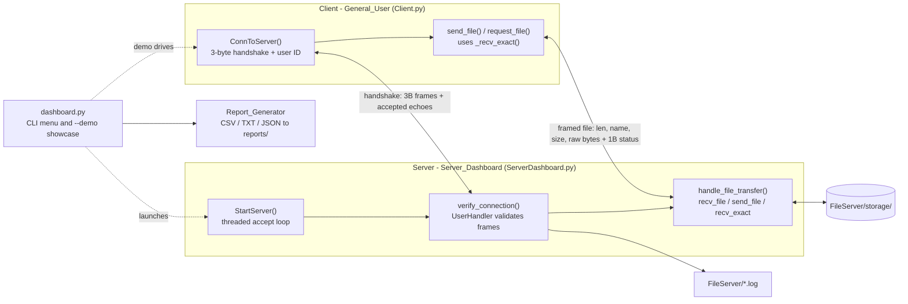

# NetForge

> A standard-library-only **TCP file-transfer server framework** built around a custom 3-byte binary handshake protocol.

## The idea

NetForge is a small but complete client/server file-transfer stack. A
single-instance server accepts TCP connections, validates a role/application
handshake using integer **control codes**, logs everything to per-module log
files, and streams files with a length-prefixed wire format. A reference client
(`General_User`) performs the same handshake and then either **uploads**
(`sender`) or **downloads** (`receiver`) a file.

The whole conversation is just a few fixed-size frames:

```
  Client                                   Server
    |                                         |
    |  Frame 1: connect|client|request  (3B)  |
    |---------------------------------------->|
    |  User ID: "alice\0"      (utf-8 + NUL)   |
    |---------------------------------------->|
    |  Frame 2: accepted|server|client  (3B)  |
    |<----------------------------------------|
    |  Frame 3: request|client|app      (3B)  |   app = sender(0x3B)
    |---------------------------------------->|         or receiver(0x2B)
    |  Frame 4: accepted|server|app     (3B)  |
    |<----------------------------------------|
    |  File frame: !Q len|name|!Q size|bytes  |
    |<--------------------------------------->|
    |  Transfer status: 0x09 ok / 0x10 fail   |
    |<----------------------------------------|
```

### Data flow at a glance

How the real components talk: the client drives the 3-byte handshake and then a
length-prefixed file frame; the server validates, then either stores an upload or
streams a download from `FileServer/storage/`. The dashboard launches/drives them
and the report generator turns connection records into CSV/TXT/JSON.



## Features

- **3-byte handshake state machine** with server-side validation of command,
  user type, user status, and application (`ServerHandler.UserHandler`).
- **Two transfer roles**: `sender` uploads a file to the server; `receiver`
  downloads a file by name from server storage.
- **Length-prefixed file framing** (`!Q` name length, name, `!Q` size, raw
  bytes) streamed in 64 KiB chunks, shared by both client and server.
- **Concurrent accept loop**: each client is handled in its own daemon thread;
  the listener wakes periodically to honour a clean shutdown flag.
- **Path-traversal-safe storage** (`os.path.basename` on all incoming names)
  and bounded reads (socket timeouts, capped user-ID length).
- **Per-module logging** to `FileServer/*.log` with handler de-duplication.
- **CSV / TXT / JSON reports** of connection data (`ReportGenerator`).
- **Branded CLI dashboard** (`dashboard.py`) that drives every feature for real.

## Quickstart

```bash
pip install -r requirements.txt   # rich/psutil are optional; core needs nothing
python3 dashboard.py              # interactive menu (branded, EOF/pipe-safe)
python3 dashboard.py --demo       # scripted end-to-end showcase, exits 0
python3 dashboard.py --demo --json  # machine-readable summary of the demo
```

Representative `python3 dashboard.py --demo` output (trimmed):

```
╔═══════════════════════════════════════════════════════════════════════════╗
║    NetForge                                                               ║
║    TCP file-transfer server framework with a 3-byte handshake protocol    ║
╚═══════════════════════════════════════════════════════════════════════════╝
Running NetForge --demo showcase

1) End-to-end loopback self-test (real handshake + file transfer)
  [*] Server listening on 127.0.0.1:58311 (daemon thread)
  [+] sender handshake -> uploaded 15360 bytes
  [+] receiver handshake -> downloaded 15360 bytes
  [+] handshake OK, upload OK, download OK, byte-for-byte round-trip OK

2) Report generation (real Report_Generator: CSV + JSON)
  [+] CSV report:  .../reports/connected_users_20260705_210224.csv
  [+] JSON report: .../reports/connected_users_20260705_210224.json
  [+] 3 connected-user records written

3) Protocol reference (real Server.user_status_code table)
  Frame 1 (client -> server)   3 bytes   connect(0xAA) | client(0x2A) | request(0x3C)
  ...
NetForge demo complete — all real features exercised successfully.
```

The `--demo` run binds an **ephemeral loopback port**, serves from a daemon
thread, performs a real sender upload and receiver download, verifies the bytes
match, and cleans up its temp files — no network or hardware required.

<!-- Screenshot slot: drop a capture of `python3 dashboard.py --demo` (or the
     interactive menu) into docs/screenshots/ and reference it here, e.g.:
     
-->

## Usage

### Dashboard menu actions (all invoke real code)

1. Run end-to-end loopback self-test (handshake + file transfer)
2. Print commands to run the real server / client
3. Show protocol + status-code reference table
4. Generate CSV/JSON report of a sample connected-users list
5. Show host / runtime system stats
6. Quit

### Run the real server

```bash
python3 ServerDashboard.py --verbose                       # auto IP, first free port 8000-8500
python3 ServerDashboard.py --host 127.0.0.1 --port 8000 --verbose
```

Uploaded files are stored under `FileServer/storage/`; that same directory is
where the server looks for files a `receiver` asks to download.

### Run the reference client

```bash
# Upload a file (sender role)
python3 Client.py --host 127.0.0.1 --port 8000 --app sender --file ./myfile.txt

# Download a file (receiver role)
python3 Client.py --host 127.0.0.1 --port 8000 --app receiver --file myfile.txt --dest-dir ./got
```

### Library API

```python
from ServerDashboard import Server_Dashboard
from Client import General_User

server = Server_Dashboard(ServerIP="127.0.0.1", ServerPort=8000)
# server.StartServer()   # blocks; run in a daemon thread for tests

client = General_User("127.0.0.1", 8000, user_id="alice")
client.ConnToServer("alice", 0x3B, filepath="myfile.txt")   # 0x3B = sender / upload
client.ConnToServer("alice", 0x2B, filepath="myfile.txt")   # 0x2B = receiver / download
```

## Protocol

The handshake is a fixed sequence of 3-byte frames (each byte is a control
code), followed by a null-terminated user ID and the file frame.

| Step | Direction | Size | Bytes / meaning |
|------|-----------|------|-----------------|
| Frame 1 | client → server | 3 | `connect(0xAA)` \| `client(0x2A)` \| `request(0x3C)` |
| User ID | client → server | N+1 | utf-8 id + null terminator `0x00` |
| Frame 2 | server → client | 3 | `accepted(0x6C)` \| `server(0x0A)` \| `client(0x2A)` |
| Frame 3 | client → server | 3 | `request(0x3C)` \| `client(0x2A)` \| app `0x2B`/`0x3B` |
| Frame 4 | server → client | 3 | `accepted(0x6C)` \| `server(0x0A)` \| app-echo |
| File frame | both | 8+N+8+size | `!Q` namelen \| name \| `!Q` size \| raw bytes |
| Transfer status | server → client | 1 | `0x09` success \| `0x10` failed |

### Selected status codes (`Server.user_status_code`)

| Hex | Meaning | Hex | Meaning |
|-----|---------|-----|---------|
| `0xAA` | connect | `0xFF` | disconnect |
| `0x0A` | server | `0x1A` | admin |
| `0x2A` | client | `0x2B` | receiver |
| `0x3B` | sender | `0x3C` | request |
| `0x6C` | accepted | `0x7C` | declined |
| `0x0C` | authorized access | `0x1C` | unauthorized access |
| `0x0D` | Connection established | `0x1D` | Connection lost |
| `0x09`* | File transfer successful | `0x10`* | File transfer failed |

\* `0x09` / `0x10` are the file-transfer status bytes (see `Client.client_control_codes`);
the full 36-entry `user_status_code` table is printed by menu option 3 / `dashboard.py --demo`.

## Testing

```bash
python3 -m pytest -q
```

Currently **22 tests pass** (smoke imports, pure logic, report generation,
logging, framing round-trip via `socketpair`, loopback handshake integration,
and the dashboard `--demo` / EOF-safety tests).

## Project layout

```
NetForge/
├── dashboard.py          # branded CLI launcher (interactive + --demo)   <- start here
├── ServerDashboard.py    # Server_Dashboard: accept loop + transfer dispatch (server entry point)
├── Client.py             # General_User: reference client (client entry point)
├── ServerHandler.py      # UserHandler: handshake validation state machine
├── ServerFunctions.py    # Server_Functions: port scan, framing helpers, send/disconnect
├── ServerSettings.py     # Server: sockets, control-code tables, shared state
├── ReportGenerator.py    # Report_Generator: CSV / TXT / JSON reports
├── server_logs.py        # Logs: per-named-logger file logging
├── requirements.txt
└── tests/                # pytest suite (test_netforge.py, test_dashboard.py)
```

## Requirements / optional dependencies

- **Python 3.8+**. The server and client core use only the standard library.
- **Optional**: `rich` (polished dashboard tables/panels — plain-ANSI fallback
  if absent) and `psutil` (richer host stats — stdlib fallback otherwise).
- **Dev/testing**: `pytest`.

Install everything with `pip install -r requirements.txt`; the dashboard works
without the optional packages, just with a simpler look.
